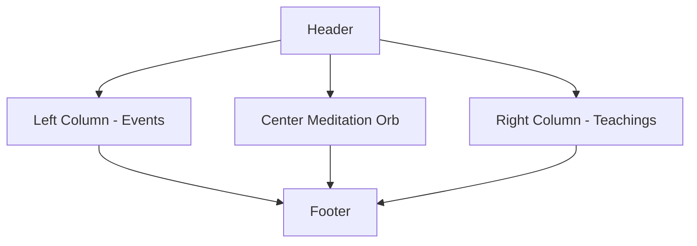

# ZenRio Meditação - Modern Meditation Platform

`v1.0.0` · 

## 🌟 Overview

ZenRio is an ultra-modern single-page meditation platform designed for Cabo Frio, Brazil. This no-scroll web app combines cutting-edge UI/UX with Buddhist meditation principles, featuring:

- Dynamic gradient backgrounds that respond to cursor movement
- Floating particle animations creating a meditative atmosphere
- Interactive 3D meditation orb with layered animations
- Auto-rotating teaching cards with smooth transitions
- Glassmorphism UI elements with backdrop blur effects

## ✨ Key Features

### 🎨 Visual Design

| Feature                      | Description                                          |
| ---------------------------- | ---------------------------------------------------- |
| **Cursor-Reactive Gradient** | Background subtly follows user's mouse movement      |
| **Floating Particles**       | 15+ animated particles create depth and motion       |
| **3D Meditation Orb**        | Multi-layered animated sphere with pulsating effects |
| **Glassmorphism UI**         | Frosted glass panels with border glow effects        |

### 🕹️ Interactions

| Component      | Behavior                                            |
| -------------- | --------------------------------------------------- |
| Buttons        | Multi-state hover animations with gradient shifts   |
| Teaching Cards | Auto-rotates every 8s with smooth transitions       |
| Event Cards    | Hover effects with subtle elevation and border glow |
| Custom Cursor  | Expands on interactive elements with blend modes    |

### 📱 Responsive Layout



## 🛠 Technical Implementation

### 📦 Dependencies

```bash
"dependencies": {
  "framer-motion": "^10.16.4",       # Advanced animations
  "react-icons": "^4.10.1",          # Lightweight icons
  "next": "^14.1.0",                 # React framework
  "react": "^18.2.0"                 # Core library
}
```

### 🏗 Component Structure

```bash
/components
├── AnimatedBackground.tsx    # Gradient + particles
├── MeditationOrb.tsx         # 3D sphere animation
├── TeachingCarousel.tsx      # Auto-rotating wisdom cards
├── GlassPanel.tsx            # Reusable glassmorphism container
└── InteractiveButton.tsx     # Animated CTA components
```

### 🚀 Performance Optimizations

- 60fps animations: Using Framer Motion's optimized renderer
- GPU acceleration: All animations use will-change and transform
- Lazy loading: Heavy assets load on interaction
- Dynamic imports: Code-split non-critical components

### 🌐 SEO Strategy

```html
<!-- Local Business Schema -->
<script type="application/ld+json">
  {
    "@context": "https://schema.org",
    "@type": "LocalBusiness",
    "name": "ZenRio Meditação",
    "geo": {
      "@type": "GeoCoordinates",
      "latitude": "-22.8784",
      "longitude": "-42.0188"
    }
  }
</script>
```

**Optimization Highlights:**

- Portuguese-language content for local search
- Geo-tagged metadata (Cabo Frio/RJ)
- Semantic HTML5 structure
- Social media meta tags
- Mobile-optimized layout

### 🎯 Conversion Elements

**Primary CTA Button**

- Gradient pulse animation
- Interactive cursor transformation
- Arrow icon motion on hover

**Event Signup**

- Multi-step form with smooth transitions
- Email validation with visual feedback
- Social proof integration points

**Teaching Carousel**

- Auto-play with manual override
- Progress indicator dots
- Card flip animations

### 🌈 Color System

| Role       | Light Mode | Dark Mode |
| ---------- | ---------- | --------- |
| Primary    | #F59E0B    | #FBBF24   |
| Secondary  | #3B82F6    | #60A5FA   |
| Background | #F8FAFC    | #0F172A   |
| Text       | #1E293B    | #F1F5F9   |

### 📱 Mobile Considerations

- Tap targets enlarged to 48x48px
- Reduced motion preference support
- Vertical stack layout under 768px

**Performance budget:**

- <100KB JavaScript
- <1s First Contentful Paint
- <3s Full Load

## 🚀 Getting Started

**Install dependencies:**

```bash
npm install
```

**Run development server:**

```bash
npm run dev
```

**Build for production:**

```bash
npm run build && npm start
```

## 📈 Roadmap

- Three.js meditation environment
- Audio-guided session player
- User accounts with progress tracking
- Localized content (EN/ES)

## 📝 License

MIT License - Free for personal and commercial use
